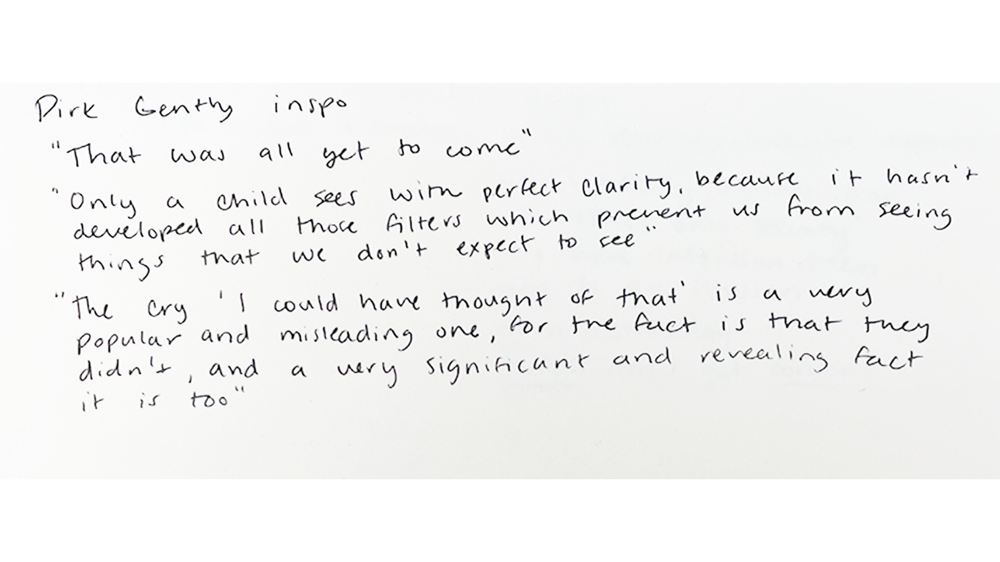
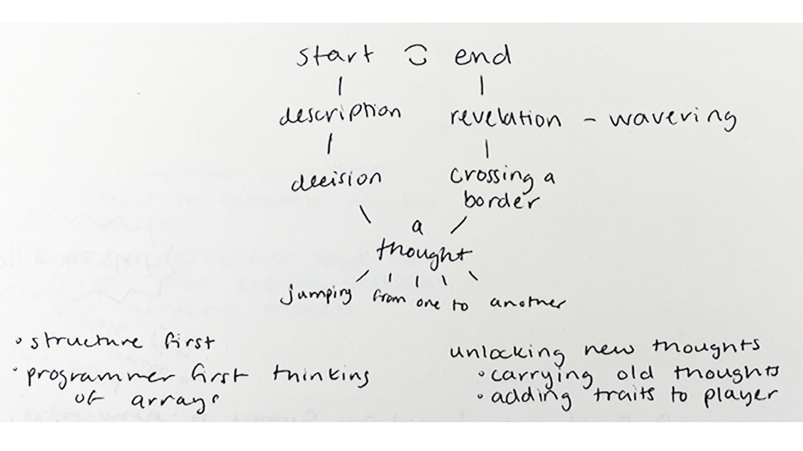
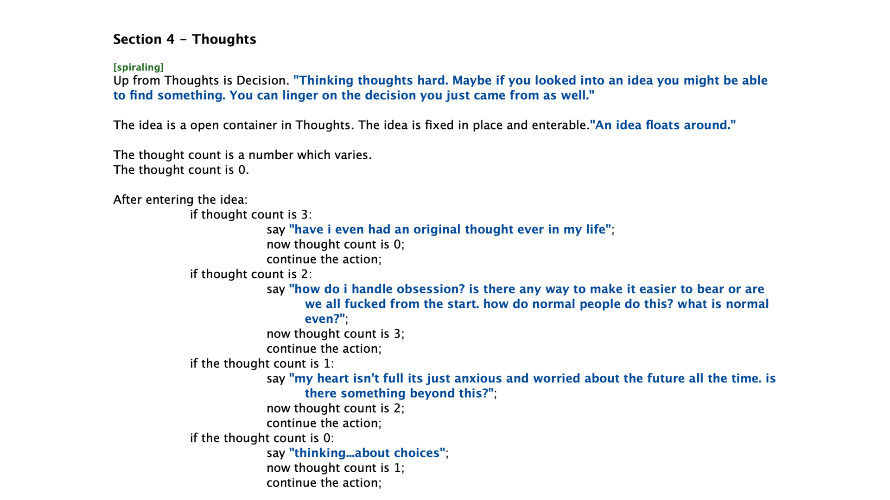

[look here for the story](http://samheckle.com/hosted/linear/)

## inspiration

something i've been interested in is rumination and memory. i've been trying to expel my own thoughts onto paper. so, i wanted to use inform 7 to actually go physically backwards in a memory, and try and trace the map of how this would be represented with text.

i've also been reading a lot about memory (cc *dirk gently's holistic detective agency* by douglas adams and *mcglue* by ottessa moshfegh) which i would also recommend for no other reason than pleasure.

## process

i started with the shape of the map i wanted first. something i've noticed when writing these interactive fictions is thinking about the whole story and the shape rather than the individual details. 

i wanted to have something that was cyclical -- the start and the end being the same. 

each "room" manifested themselves as a part of the thought process. ideas manifest themselves as containers that you can go into. they change each time you enter the idea as well, as demonstrated below.

## final

i ended up breaking my story into separate sections, each with their respective room. i didn't play around too much with items but i might continue to do that later.

list of rooms: Death, Revelation, Spiraling, Thoughts, Decision, Naming, Birth

[look here for the story again](http://samheckle.com/hosted/linear/)

----
# resources

[inform map docs](http://inform7.com/book/RB_3_2.html)
[inform understand docs](http://inform7.com/book/WI_17_1.html)
[multiple rooms inside another](https://intfiction.org/t/multiple-rooms-inside-another/10642)
[iterating through list](https://www.reddit.com/r/Inform7/comments/lzlj7f/how_to_iterate_through_list_of_values/)
[inform end docs](http://inform7.com/book/RB_11_6.html)