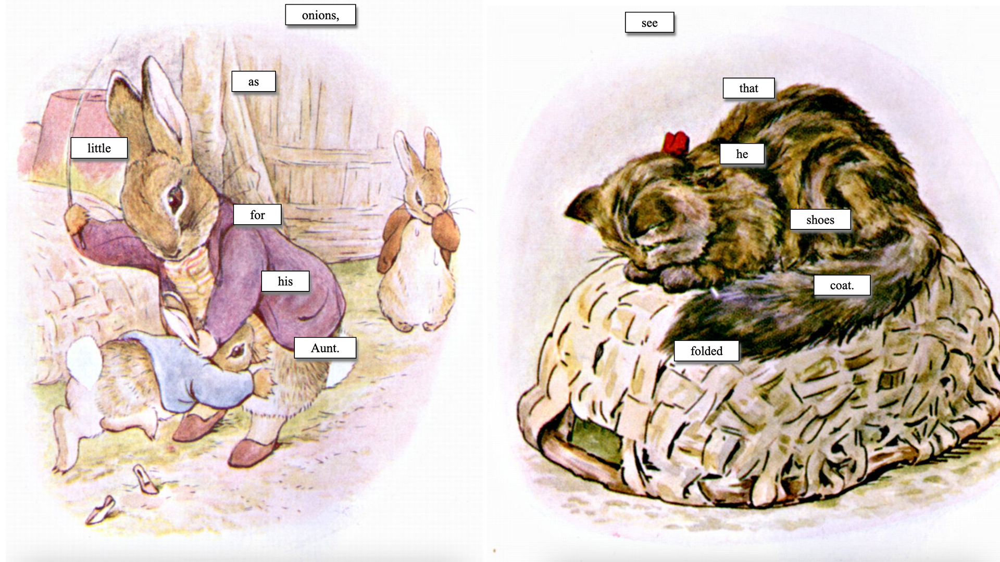

[try it out here!](http://samheckle.com/hosted/gen-blackout-poetry/)

[server code](https://glitch.com/edit/#!/planet-green-flute)
[client code](https://github.com/samheckle/rwet/blob/master/final/main.js)

## inspiration

initially i was inspired by my assignment 2 where i did a cut up of beatrice potter's written work. so, in a similar vein, i created a piece that combines this cut up with fridge magnet poetry.

[my original cut up](https://github.com/samheckle/rwet/blob/master/assignment-2/assignment-2.ipynb)

what i also wanted to experiment with hosting on glitch and using it as a server to make REST api calls to.

for me, i have always loved magnet poetry and every apartment i have ever lived in has had some sort of poetry that i build semi-regularly. combining the nostalgia of home with my childhood memories of beatrice potter allowed me to find space to feel those emotions again.

## process

what i first did was make sure i could get the server working. 
[it is hosted here](https://glitch.com/edit/#!/planet-green-flute)

i was having a series of issues with Cross-Origin Resource Sharing (CORS) which is a security protocol that a browser takes to ensure that no compromising requests are being made to the server. the problem is that it also limits resource-sharing between your local machine and any resources you need to access on a remote server. 

there were two solutions i tried:
1) installing an extension to my browser to remove that particular security requirement
[here is the firefox extension](https://addons.mozilla.org/en-US/firefox/addon/access-control-allow-origin/)
2) changing my python / flask server to accept all CORS
[i followed this tutorial](https://dev.to/matheusguimaraes/fast-way-to-enable-cors-in-flask-servers-42p0)
but i also installed [this library](https://flask-cors.readthedocs.io/en/latest/) to handle the CORS requests.

basically i had to enable in my server this line of code (after installing the library properly):
```cors = CORS(app, resources={r"/api/*": {"origins": "*"}})```

after getting the server working, i started on the front-end. i had to create a request using `fetch()` and pass in the CORS header there as well. i tried using the header `mode: 'no-cors'` but it appears to have an issue reading the JSON object and not passing the header correctly. it was a two-sided process, figuring out to set the server to accept and also sending the correct header in the first place. 
```
const response = await fetch("https://planet-green-flute.glitch.me/", {
    method: "GET",
    mode: "cors",
    headers: {
      "Access-Control-Allow-Origin": "*",
    },
  })
```

with that, my server and client were interacting the way i wanted to and i was able to port over the components of my cut up that i liked. this entailed pulling the python code [which i tested in this jupyter notebook](https://github.com/samheckle/rwet/blob/master/final/final.ipynb)  and putting it up on the server, then ensuring the format of what was being sent was correct.

on the client side, i parsed the data by each word in the response, and then set the position and design superimposed on top of an illustration from the original book "The Tale of Benjamin Bunny". i manually had to download these images because it was too much effort to try and script something where i could spend 20 minutes doing myself. perhaps later i will incorporate this as a feature, but i struggled to find a place that hosted the images themselves where i could easily make a request to.

## final



----
# resources
[how to host on glitch - a tutorial by allison](https://github.com/aparrish/material-of-language/blob/master/standalone-and-webapps.ipynb)
[glitch flask python starter code](https://glitch.com/~minimal-python3-flask)
[filtering in python](https://www.geeksforgeeks.org/filter-in-python/)
[lambda in python](https://realpython.com/python-lambda/)
[tutorial for enabling cors in flask](https://dev.to/matheusguimaraes/fast-way-to-enable-cors-in-flask-servers-42p0)
[fetch in HTML5](https://developer.mozilla.org/en-US/docs/Web/API/Fetch_API/Using_Fetch)
[fetch debugging w end of input with no-cors](https://stackoverflow.com/questions/45696999/fetch-unexpected-end-of-input)
