## an idea

Dave and I were chatting about things we have been into lately and Dave mentioned he has really been into cooking, but mentioned the one big kitchen item he was missing was a scale. So we thought, "ok, portable scale, how do we build one?"

The first thing we looked up was how to weigh things (load cells) electronics we needed (load cell _amplifiers_), and started looking at prices. Some cells were originally thought to be USD$300 and we almost scrapped the project, but!

Fortunately, we [found a kit](https://www.amazon.com/gp/product/B08KRWY43Y/ref=ppx_yo_dt_b_asin_title_o01_s00?ie=UTF8&psc=1)

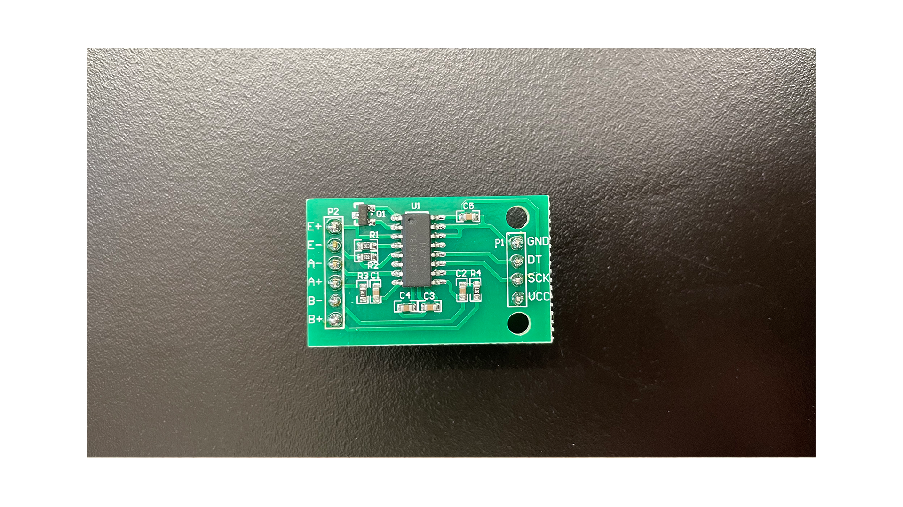

## first frustrations
When the load cell arrived, we had a ton of difficulty wiring it up. We had to solder the amplifier to the wires of the cell, which were stranded and was challenging to keep together (yeah we could have soldered that but)
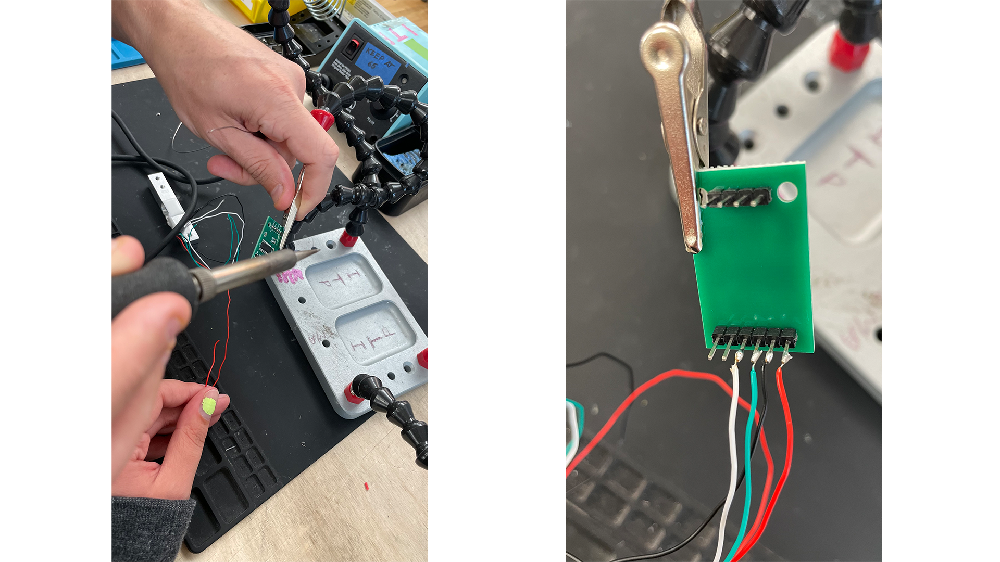

We ultimately ran into an issue with our wires literally being crossed, so we had to run to the soldering station a few times.

## housing

After figuring out the load cell, we thought about how to display it. Our initial sketches:

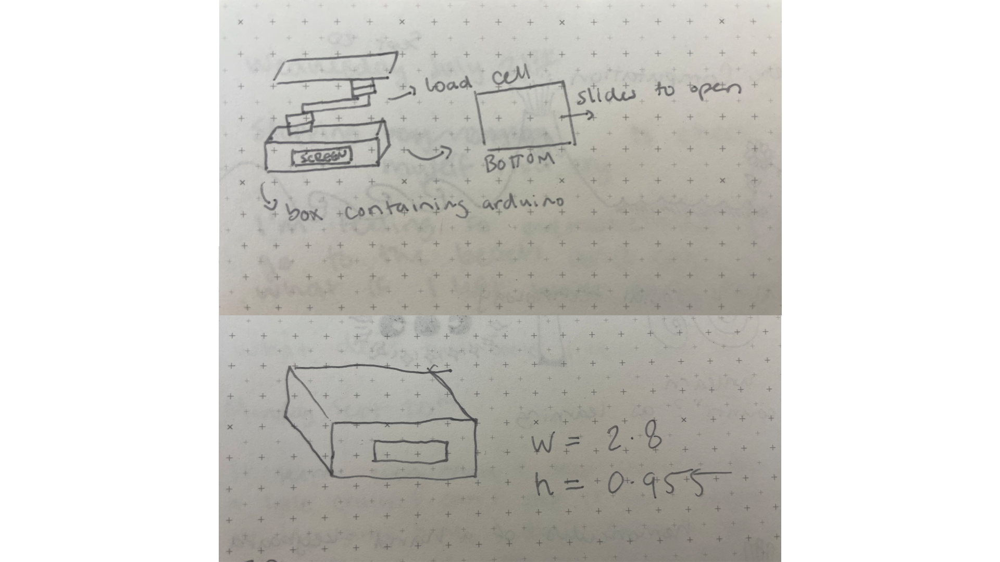

We learned that the photo cell works best on a sort of "perch" where it was able to more freely bend and get a more accurate reading. Then we realized that we could store all the arduino bits inside a box underneath, and have a screen that displays the given weight.

## prototypes

We started out with some cardboard prototypes:
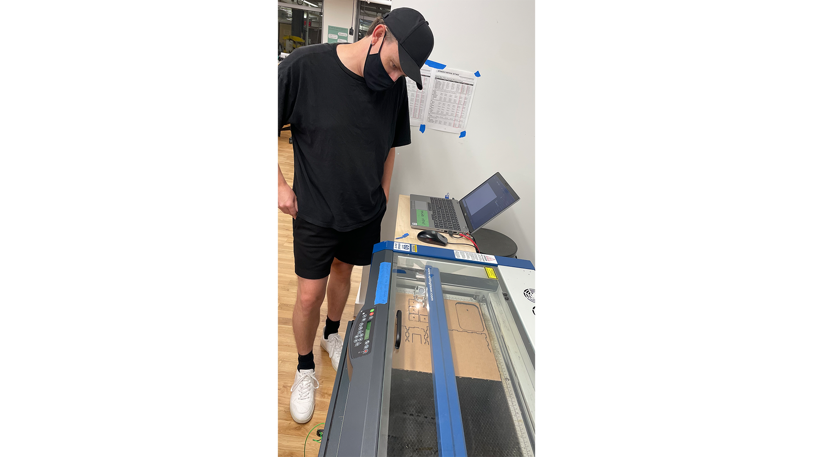

After a _few_ mishaps (see oops below), we finally ended up with our first assembled piece for housing.
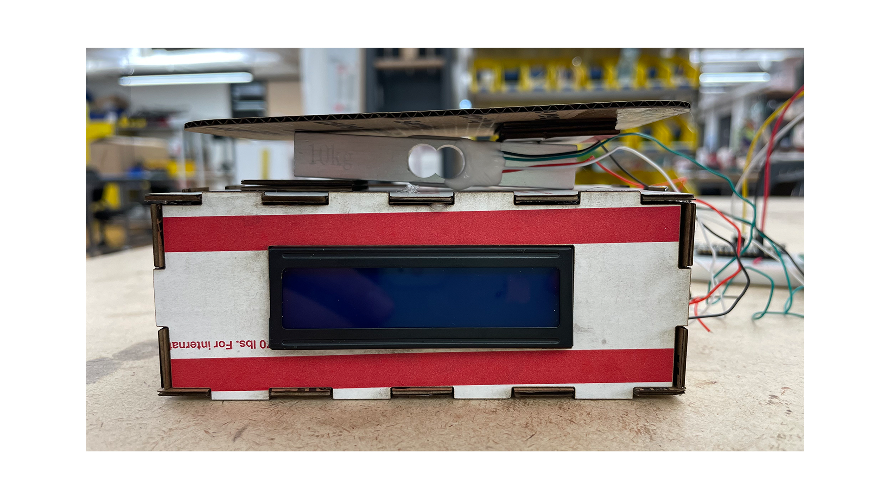

We did realize we needed to add some additional holes for cables, so the design only had to change a little from the initial concept.

## emphasis on physical computing

The next bit was tricky -- we had to figure out a way to wire up an LCD screen to a Nano 33. We initially switched to an Uno, but we didn't have a cable for this to connect to the phone, and we had purchased a micro-micro USB cable for the Nano 33 to be able to communicate with the phone. 

So, we switched to the ESP32, a beloved board for the two of us. 

Even though we had switched, there was something off about the LCD screen. The bug: the screen was turning on but nothing was appearing. 

All of the wiring was correct and the code was absolutely barebones. We even tried a different LCD screen, to no avail. We even added an I2C screen to see if there was somehow a mixup in the wires.

After too long, we rewatched a few videos and low and behond -- we had to _turn the potentiometer on the I2C screen to lower the contrast_. After so much head banging, it was only a matter of a hidden potentiometer on a sensor we were both too unfamiliar with to figure out what was wrong.

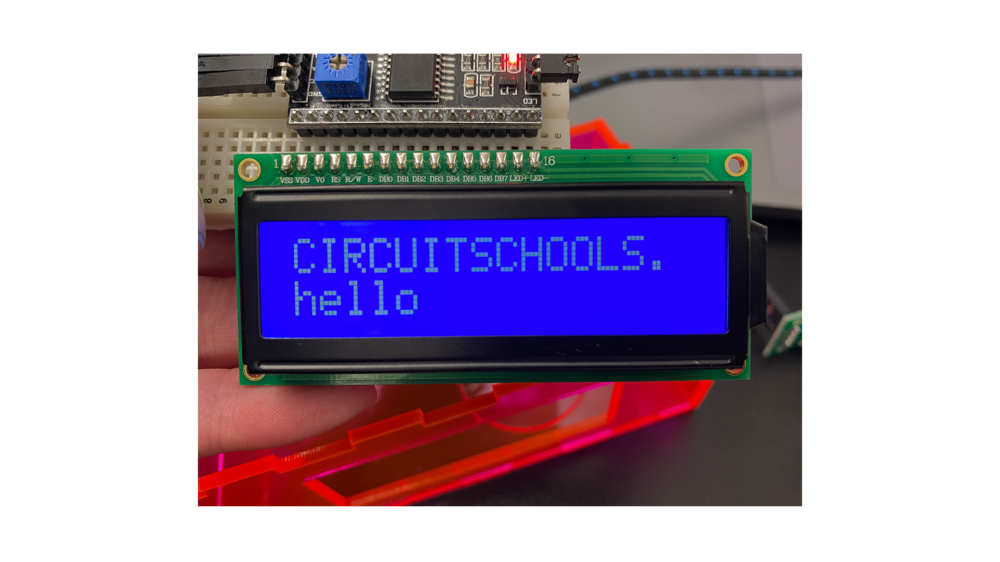

## why a scale again?
Throughout this process, Dave and I were curious about starting small with scope and adding to it as we went. But, even after wanting to build a scale, we still couldn't figure out how to push the idea further. 

Rajshree actually had suggested weighing something unconventional, like something heavy or burdonsome on your shoulders, feelings weighing you down. This lead us to: weighing your emotional baggage. This new scale would still be functional, but weigh how much stress you were under. This isn't directly calculated, rather a phrase comes up to the screen without telling you a number eg. "heavy" and "not so heavy". 

## technical details
# diagram
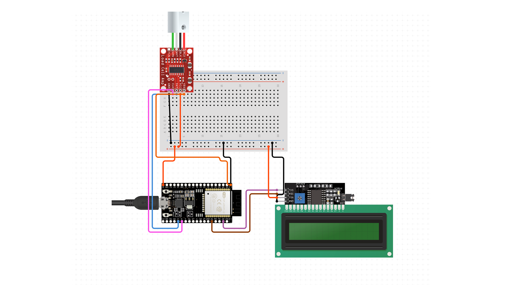

# laser ai file
[file.ai](https://drive.google.com/file/d/159637dx6I1Jy-R9V8b9tDvWbjwFxZtJI/view?usp=sharing)

# code

[link to repository](https://github.com/davidalexandercurrie/emotional-weight)

## final assembly

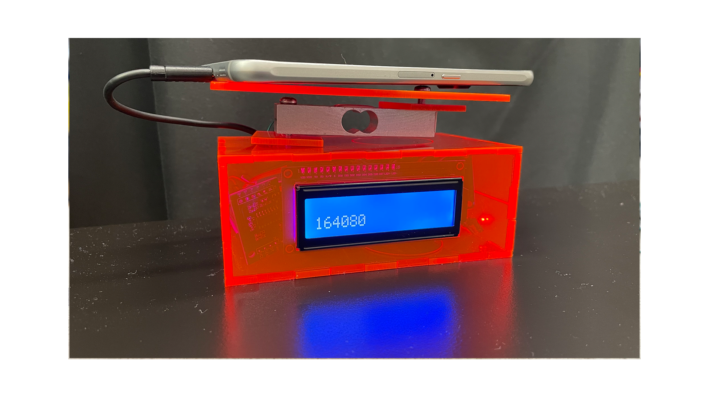
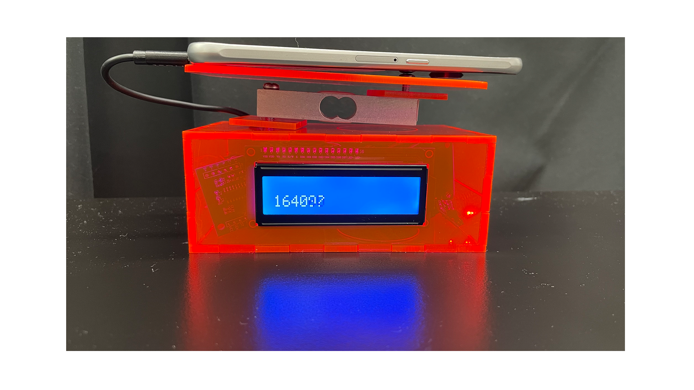
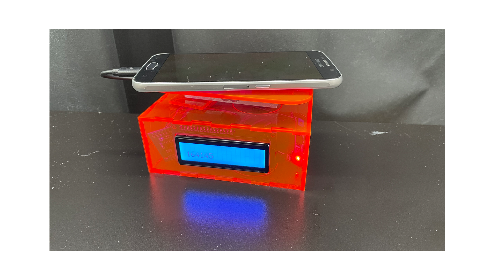

## oops

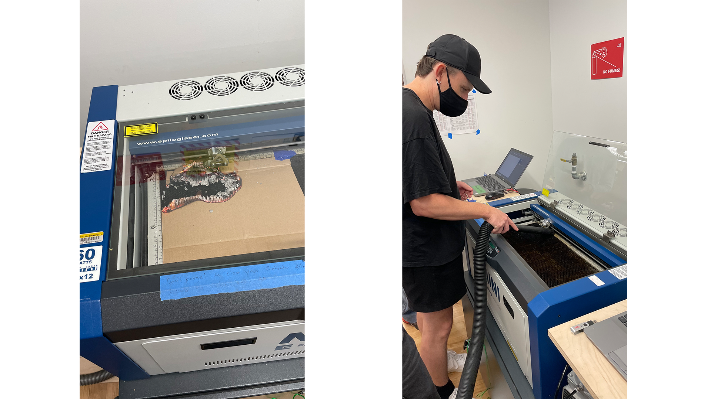
