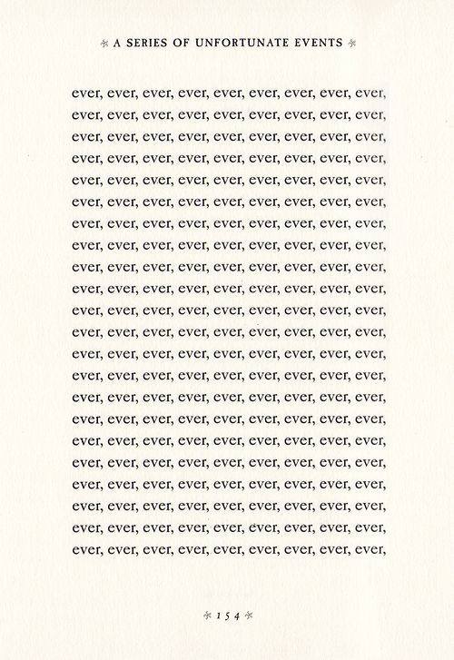
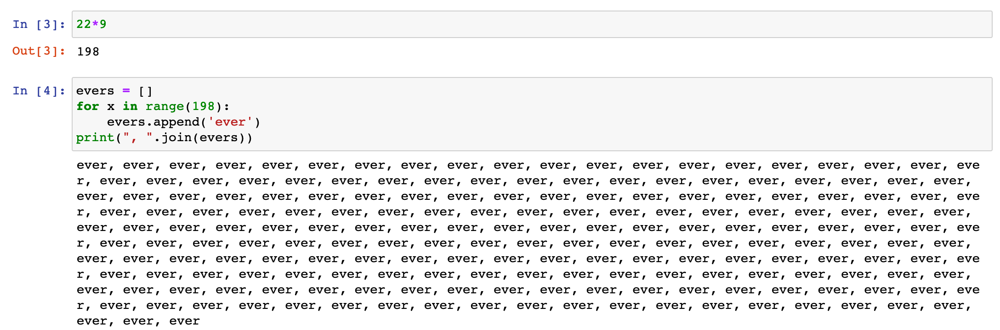
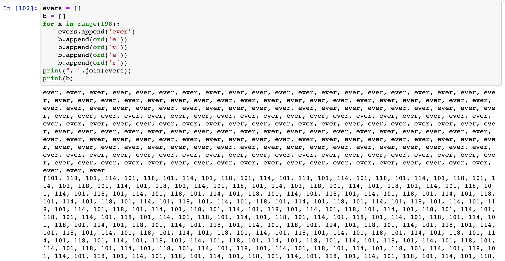
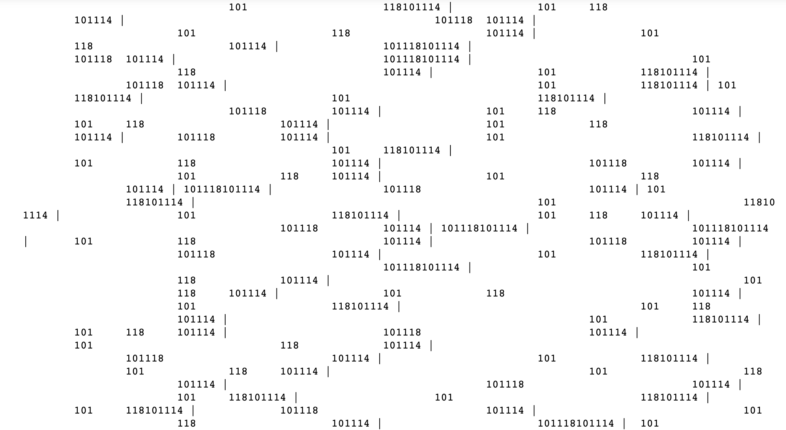

# inspiration

there's a distinct page from my childhood in one of Lemony Snicket's *Series of Unfortunate Events* novels -- an entire page filled with 'ever'.

## process

i did a basic count and print of all the evers on the page:

and i also did an exploration of unicode characters

Each character has a number representation:

    e = 101
    v = 118
    e = 101
    r = 118

since this was my first time playing around with python in this context, I fiddled with some graphs and printing without using new lines `print(char, end=' | ')`

## final output
My final composition was messing with loops and utilizing randomly generated tabs throughout. 

I hope to make work that is less pseudo-random and more "noise"-like, utilizing algorithms related to Perlin Noise.

----
## resources
[code](https://github.com/samheckle/mol/blob/master/ever.ipynb)