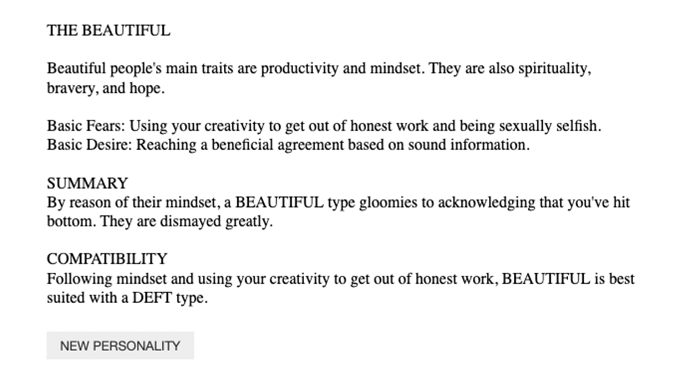
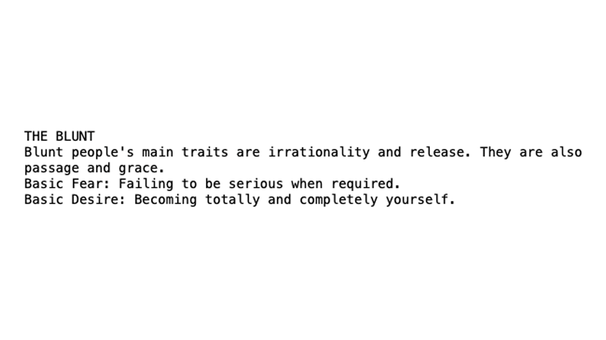
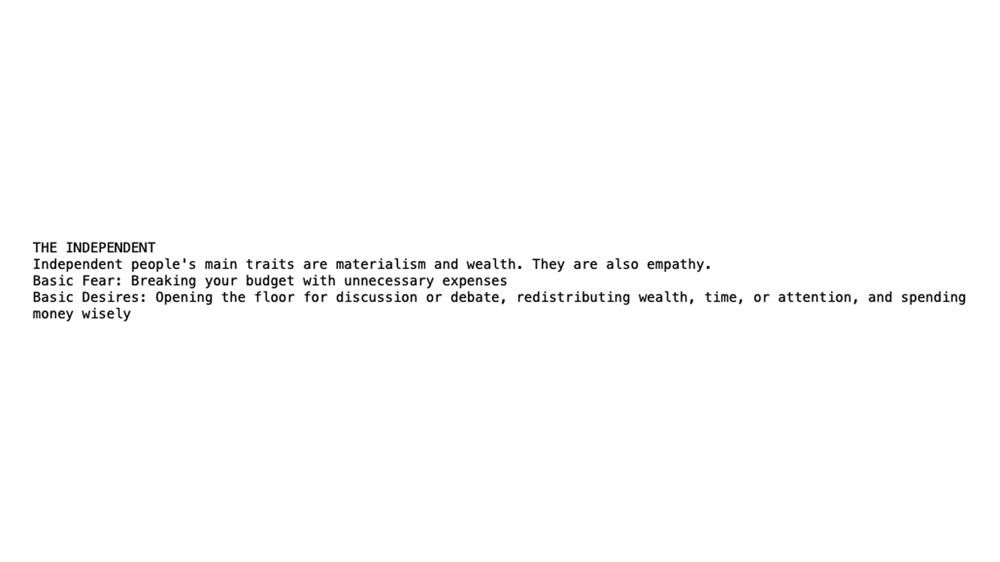
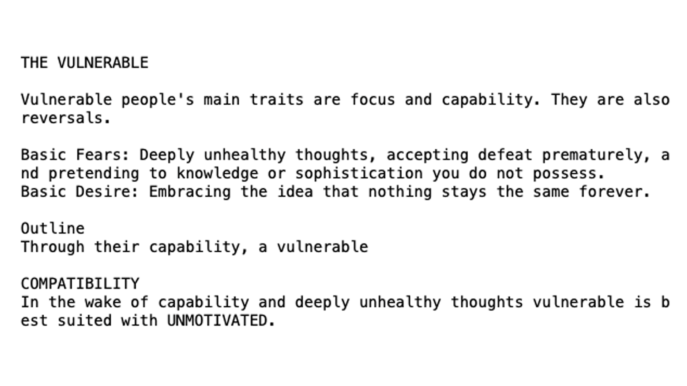
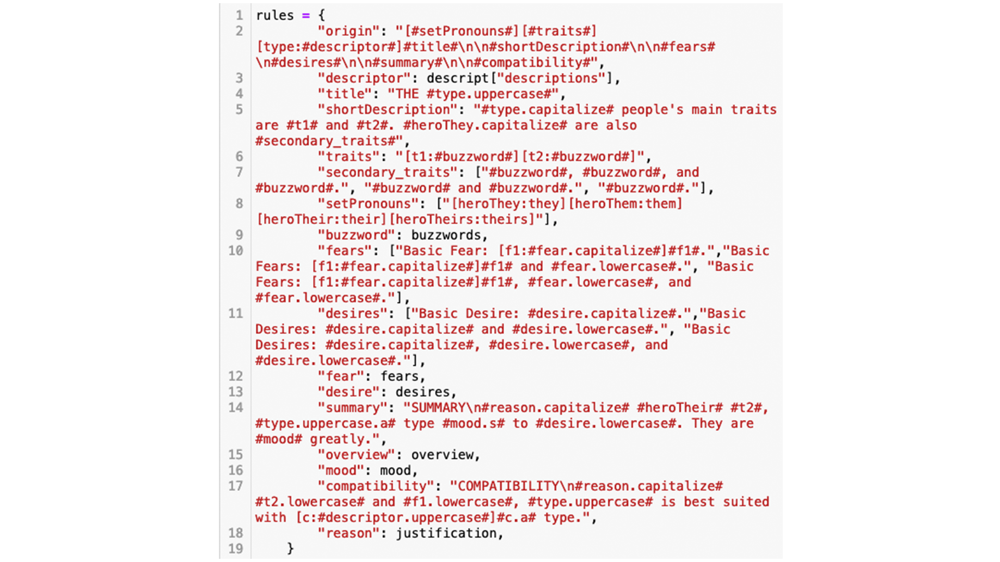
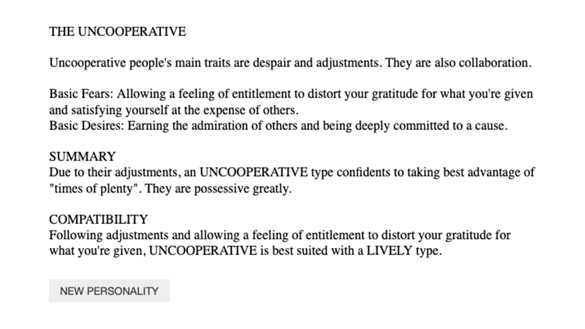

[try it out here!](http://samheckle.com/hosted/pg/)

[link to code](https://github.com/samheckle/rwet/blob/master/assignment-3/personality-generator.ipynb)

## inspiration

i've wanted to work with personality tests for a moment, and this seemed like a good opportunity to explore the output of personality tests. specifically, i drew inspiration from enneagram, myers briggs, and astrology analysis as my baseline for what i wanted to create. 

i looked at these examples as my inspiration (you can also read more about the tests themselves):
[enneagram description](https://www.enneagraminstitute.com/the-traditional-enneagram)
[enneagram type 1](https://www.enneagraminstitute.com/type-1)
[enneagram type descriptions](https://www.enneagraminstitute.com/type-descriptions)

[myers briggs personality types](https://www.16personalities.com/personality-types)
[myers briggs ENFP](https://www.16personalities.com/enfp-personality)
[myers briggs ISTJ strengths & weaknesses](https://www.16personalities.com/istj-strengths-and-weaknesses)

[astrology moon signs](https://cafeastrology.com/articles/mooninsigns_pg2.html)
[astrology moon signs in relation to their sun](https://blog.prepscholar.com/scorpio-moon-sign)

## process

i began with identifying what i wanted to include in my version of this generator. key features of each personality test result i identified:
1. title
2. brief description with important traits
3. strengths / weaknesses, desires / fears
4. longer description
5. compatibility with other types

this translated into my ruleset pretty directly:

    rules = {
        "origin": "#title#",
        "title": "THE [type:#description#]#type.uppercase#",
        "description": descript["descriptions"]
    }

something i _didn't_ realize for awhile is that you can save states of effectively variables using `[]` and whatever you want the data to be saved as. in the above example i use `type` as my variable name and pulling that randomly from my source files. 

here are some in-progress screenshots of what was being generated:

speaking of my source files, these came from the corpora project:

[moods](https://github.com/dariusk/corpora/tree/master/data/humans)
[tarot interpretation](https://github.com/dariusk/corpora/blob/master/data/divination/tarot_interpretations.json)
[adj for describing people](https://github.com/dariusk/corpora/blob/master/data/humans/descriptions.json)

i pulled these in using the following code:

    import json
    with open('descriptions.json') as f:
        descript = json.load(f)
    with open('moods.json') as f:
        mood = json.load(f)["moods"]
    with open('tarot_interpretations.json') as f:
        interpret = json.load(f)

    # post-processing data
    buzzwords = []
    fears = []
    desires = []
    for i in interpret["tarot_interpretations"]:
        buzzwords.extend(i["keywords"])
        desires.extend(i["meanings"]["light"])
        fears.extend(i["meanings"]["shadow"])

i selected moods, tarot interpretations, and adjectives for describing people from the corpora project, and parsed it as needed. the only one i did more data processing on was tarot interpretations, because the "keywords" can be used as traits of a person. for the light and shadow, i made those into fears and desires for each personality. 

i also added a button, which reruns the cell so that the personalities are generated endlessly. this was done with the following code:

    def run_all(ev):
        display(Javascript('IPython.notebook.execute_cells_below()'))

    html_src = "<body>
"+"".join(story).replace("\n", " ")+"
</body></html>"
    show_html(html_src)
    button = widgets.Button(description="NEW PERSONALITY")
    button.on_click(run_all)
    display(button)

## final

[link to code (again)](https://github.com/samheckle/rwet/blob/master/assignment-3/personality-generator.ipynb)

----
# resources
[tracery and python notebook](https://github.com/aparrish/rwet/blob/master/tracery-and-python.ipynb)
[tracery repository](https://github.com/galaxykate/tracery)
[tracery tutorial](http://www.crystalcodepalace.com/traceryTut.html)
[ipython display documentation](https://ipython.readthedocs.io/en/stable/api/generated/IPython.display.html)
[running all cells from button](https://stackoverflow.com/questions/32714783/ipython-run-all-cells-below-from-a-widget)

