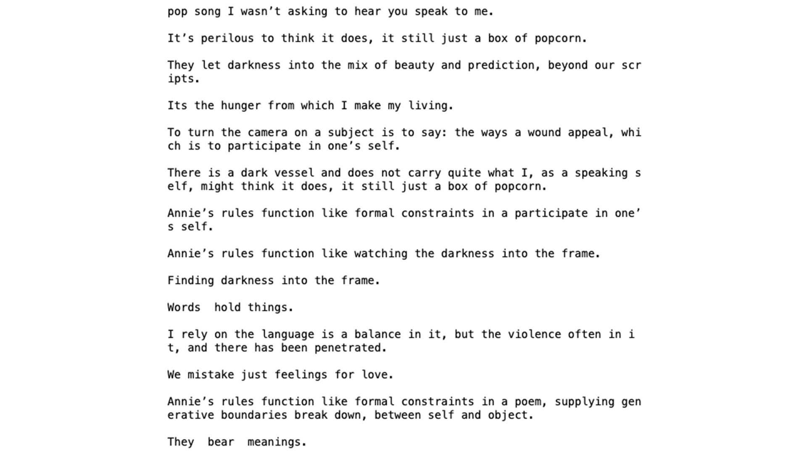
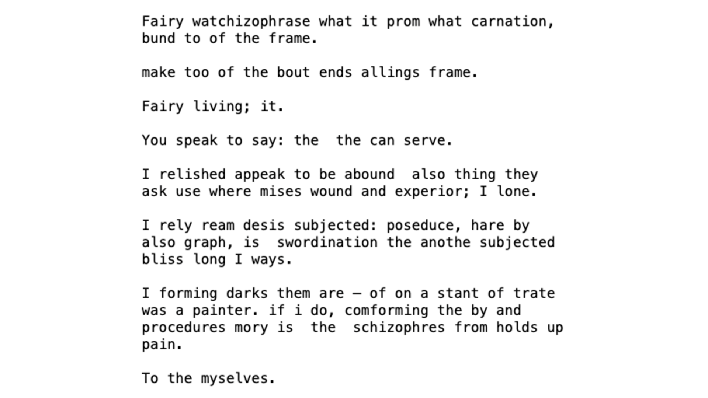
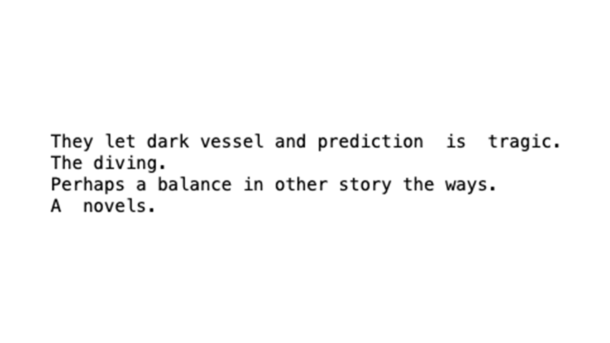
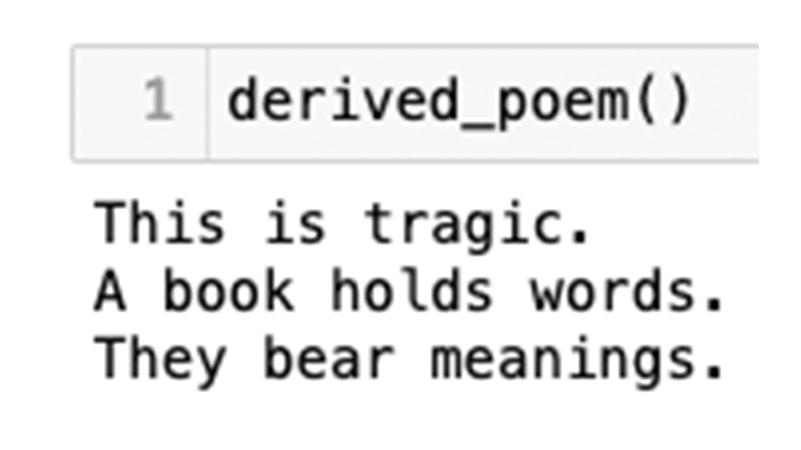
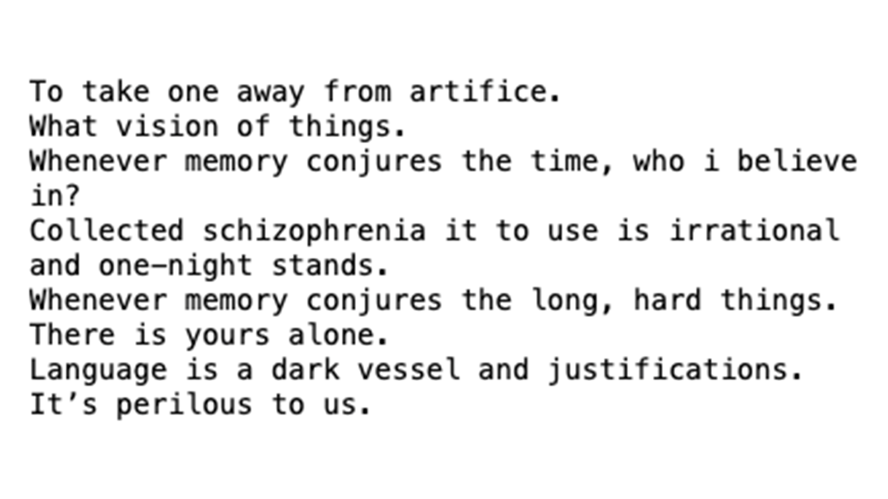
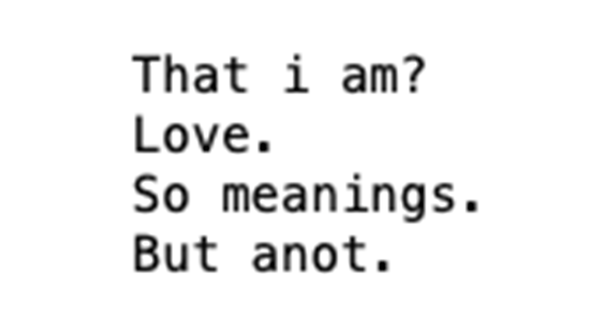

## inspiration

my original idea for this project was to work on making a phonetic breakdown of words generated from a sentence. given that we are working on that this upcoming week, i am preparing my corpus for what i want to break down in the next week. the corpus itself is something that is relevant to my thesis -- drawing from readings about intimacy and technology. 

a few big questions i want to answer here: how can we be intimate with technology? or is technology only another medium to be intimate with other people? what drives intimacy?

## process

the [initial corpus](https://github.com/samheckle/rwet/blob/742bb5a11eebd85ffdeb488a20a98a5fd39a9721/assignment-5/corpus.txt) was created from excerpts and my notes from the following books:
* _Make it Scream, Make it Burn_ by Leslie Jamison
* _Pop Song: Adventures in Art and Intimacy_ by Larissa Pham
* _The Collected Schizophrenia_ by Esme Wang
* _The Carrier Bag Theory of Fiction_ by Ursula K. Le Guin

one thing i will note is that i _did not_ get permission to use these books, nor did i write them myself. 

each iteration below goes through the process of how i created my short poems though.

after creating the structure i wanted to see what the output would be on short sentences that were created from short sentences. i created a new file that pulls in the output from the previous markov chains that resulted in [this file](https://github.com/samheckle/rwet/blob/0650ae109b8327313284314dc87f7a3b4590904f/assignment-5/derived-corpus.txt)

<!-- ## final -->

----
# resources
[code](https://github.com/samheckle/rwet/blob/master/assignment-5/assignment-5.ipynb) [in-class tutorial](https://github.com/aparrish/predictive-text-and-text-generation/blob/master/predictive-text-and-text-generation.ipynb)