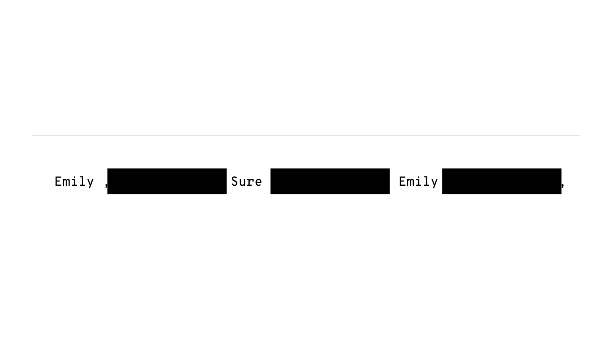
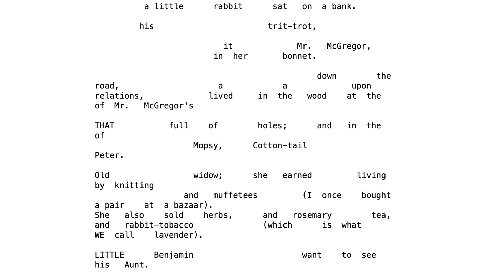
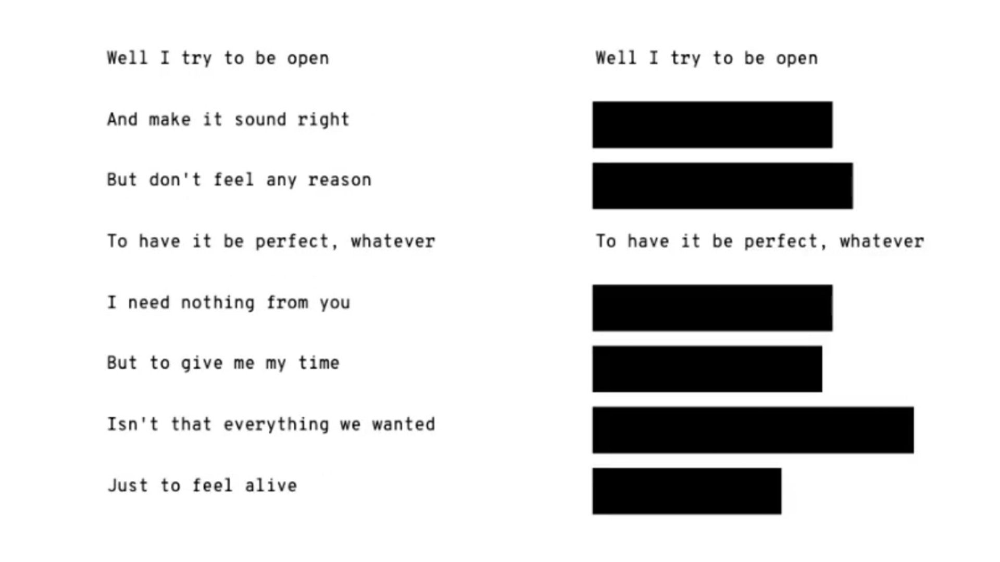
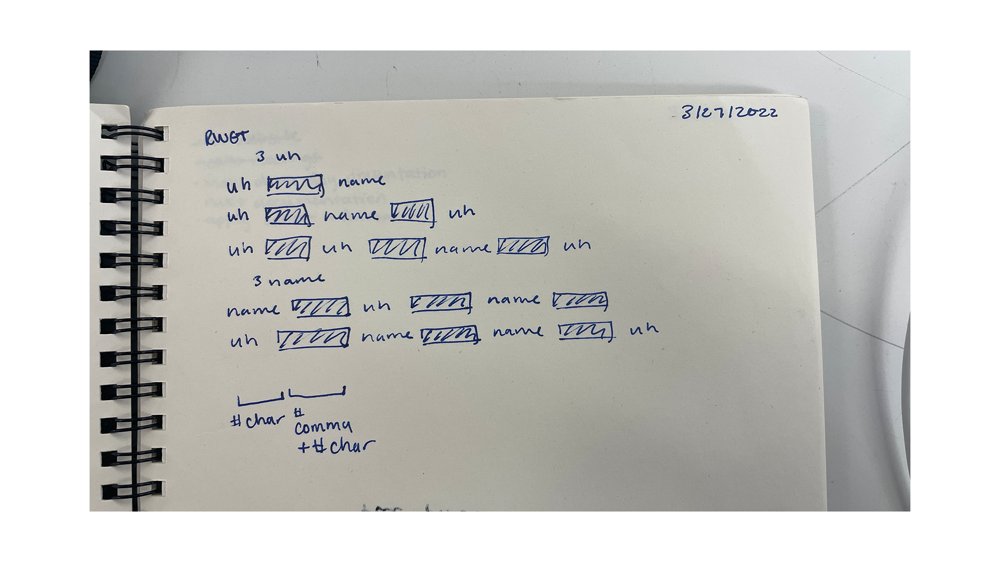

[code](https://github.com/samheckle/rwet/blob/master/assignment-4/assignment-4.ipynb)

## on blackout poetry

some initial outputs

    subtiy ,,,,,,,,,,, oh ,,,,,,,,,,, Immortality ,,,,,,,,,,,

    Shhhh ,,,,,,,,,,,,,,,,,,,,, Witchcraft ,,,,,,,,,,,,,,,,,,,,, antique ,,,,,,,,,,,,,,,,,,,,,  ,,,,,,,,,,,,,,,,,,,,,

    My ,,,,,,,,,,,,,,,,,,, crap ,,,,,,,,,,,,,,,,,,, underworld ,,,,,,,,,,,,,,,,,,, crap

    Whoa ,,,,,,,,,,,,,,,,,,,,,,,,,,, Ow ,,,,,,,,,,,,,,,,,,,,,,,,,,, vampiresl ,,,,,,,,,,,,,,,,,,,,,,,,,,, man

my favorite being: "Whoa ,,,,,,,,,,,,,,,,,,,,,,,,,,, Ow ,,,,,,,,,,,,,,,,,,,,,,,,,,, vampiresl ,,,,,,,,,,,,,,,,,,,,,,,,,,, man"

## inspiration

i wanted to create another type of blackout poetry based of my first cut up, which was about beatrice potter's tale of peter rabbit.

that original output can be viewed [here]() but here is a sample of what was produced.

even after this, i actually tried some of my own blackout poetry, using the flat python library. i had a particular song that i really enjoyed, and i noticed that each couplet of lines in the stanza can be put together as individual thoughts.

so, taking this idea and expanding it further, i took two pieces of literature -- *Twilight* by Stephanie Meyer and *50 Shades of Grey* by E. L. James as my corpus. since *50 Shades* was originally written as a fanfiction of *Twilight*, i wanted to tear them up and mix them together as parent and child. 

## process

i found text files of both novels and used them as my baseline. from there, i used spacy to parse the text explicitly for proper nouns (so names, places) and interjections. something that is common in both is the use of interjections, especially because it is a huge part of Bella Swan's character in *Twilight*. 

    # getting interjections
    uh_twilight = [item.text for item in twilight if item.tag_ == 'UH']
    uh_shades = [item.text for item in shades if item.tag_ == 'UH'] 

    # getting proper nouns
    nnp_twilight = [item.text for item in twilight if item.tag_ == 'NNP']
    nnp_shades = [item.text for item in shades if item.tag_ == 'NNP']

i also cleaned up the resulting arrays, since there was punctuation i didn't want along with duplicates.

from there, i had to sketch out how exactly i wanted the sentences to be constructed -- were there particular ways i wanted it to be formatted?

and that resulted in my ruleset

    rules = {
        'origin': ['#uh.capitalize# ,,, #nnp#', 
                '#uh.capitalize# ,,, #nnp# ,,, #uh#', 
                '#uh.capitalize# ,,, #uh# ,,, #nnp# ,,, #uh#', 
                '#nnp# ,,, #uh# ,,, #nnp# ,,,', 
                '#uh.capitalize# ,,, #nnp# ,,, #nnp# ,,, #uh# ,,,'],
        'uh': parsed_uh,
        'nnp': parsed_nnp
    }

i added these extraneous commas to represent where i wanted the black boxes to go. i ultimately did end up appending extra commas to have alternative lengths throughout so that each generated sentence would have different covered "text". 

some issues i was running into, however, was that the text and rectangles operate on different layers. not only that, but the rectangles are at a different scale than the text, so each character does not have a definitive width to use as a baseline for the width of the rectangle. 

## going forward
some other ideas to explore going forward:
1. getting rectangles to work
2. actually generating more text instead of faking it (perhaps even randomly selecting the blackout portions similar to the original concept)

----
# resources