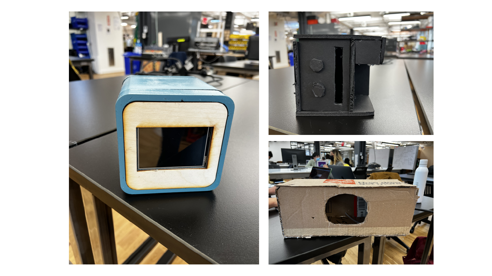
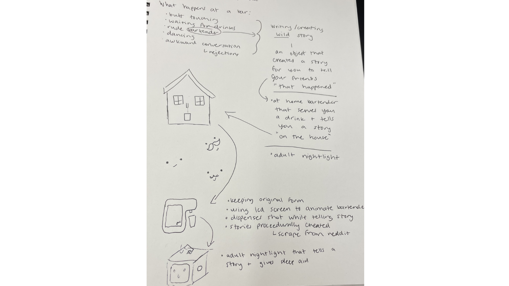
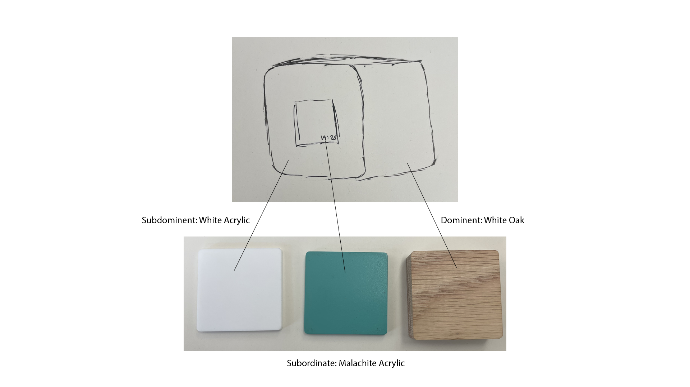
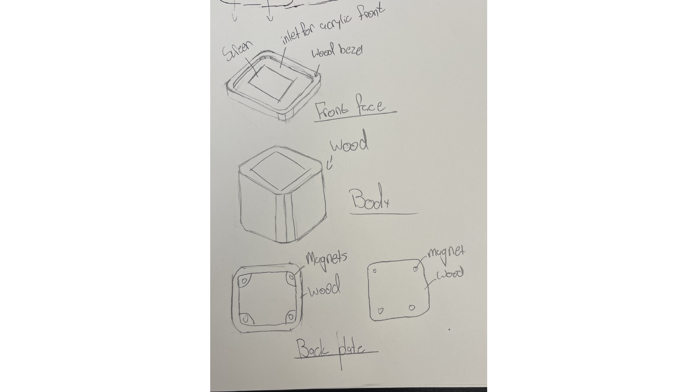
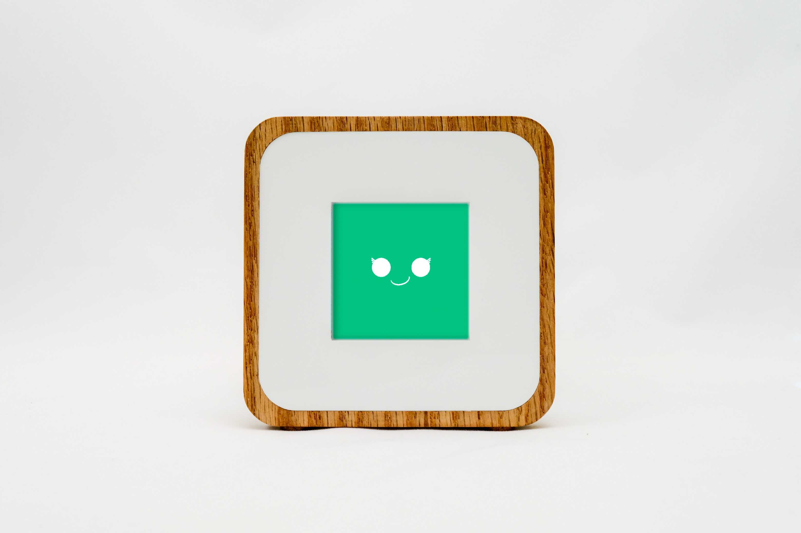

## About a Pivot
Philip and my original idea was explicitly around drinking, and specifically was designed to create a mutual drinking experience. 
[link to Philip's brainstorming post](https://cadoux-itp.notion.site/Fall-2021-Blog-2f87c6bb054f45f1aeebeb3dbcb873ca?p=06156af79a724b2fa10eff72523630da)

We ended up pivoting to::

    An adult nightlight that tells you a bar story to help you fall 
    asleep and dispenses a sleep-aid

We are now curating a bar experience from the comfort of your own bed, so you can regale your friends with tales of your wild night without actually needing to leave your hotel room.

## CMF Breakdown

## From A Concept

After a tumultuous ideation process, Philip and I have finally created a product we are proud of. Our initial idea was to create a solitary drinking experience, which then evolved into a multi-person drinking experience. We wanted to enhance the intimacy of being in a bar, which is already an inherently intimate setting. The problem we kept running into was trying to gamify it, which does not necessarily imply an absurd design. We focused too much on the way to achieve the feeling of being connected with another person. 

However.

If we flipped that idea around, what if we removed the other person from the picture?

What if we removed the _whole bar_ from a design intended to augment the bar experience?

What if we brought the bar experience _to you_?

What if you didn't want to go out, but still felt obligated to tell your friends you did?

So, how can we create the bar experience from your own bed?

Introducing...

The Adult NightLight™️

    

`youtube: https://youtu.be/t8E7uKg4IqM`

## Software

# Generated Stories

The first part of the software process was generating the stories, which means finding a corpus. Reddit is a great place to find user submitted stories, and I ended up using the [snoowrap api](https://www.npmjs.com/package/snoowrap).

From there, it was a matter of picking the thread (which ended up being pulled from r/AskReddit) and pulling the top level comments. We pulled about 500 separate stories to use as our corpus for our generation script.

After that, we used a markov chain (to see what _these_ do, check out the wiki page), and this specific [javascript library](https://github.com/Edwin-Pratt/js-markov) implementation.

[final generation code](https://github.com/samheckle/nightlight/blob/main/script.js)

# Processing 

Processing was a bit more difficult than the story generation. We started with the animation  

[final processing code](https://github.com/samheckle/nightlight/blob/main/nightlight.pde)

# Previous iteration blog posts for this project:

[first ideation](https://cadoux-itp.notion.site/Fall-2021-Blog-2f87c6bb054f45f1aeebeb3dbcb873ca?p=06156af79a724b2fa10eff72523630da)
[second ideation](http://samheckle.com/blog/absurd/assignment-3/)

