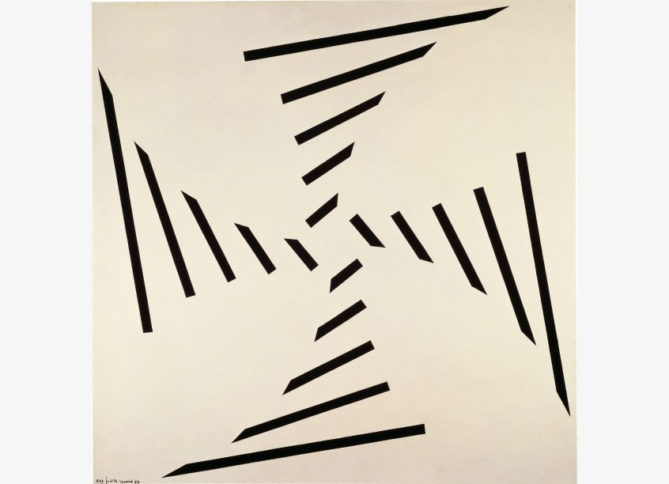
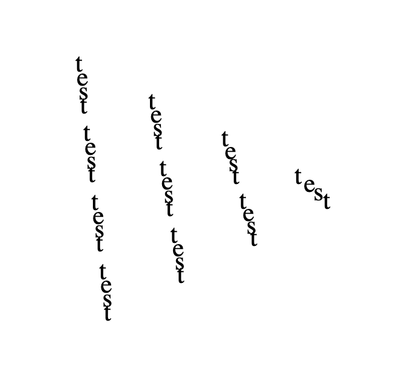
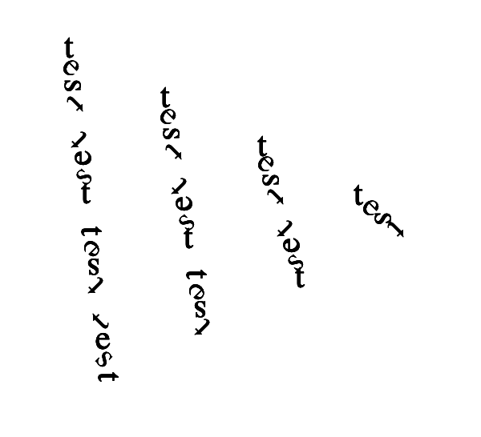
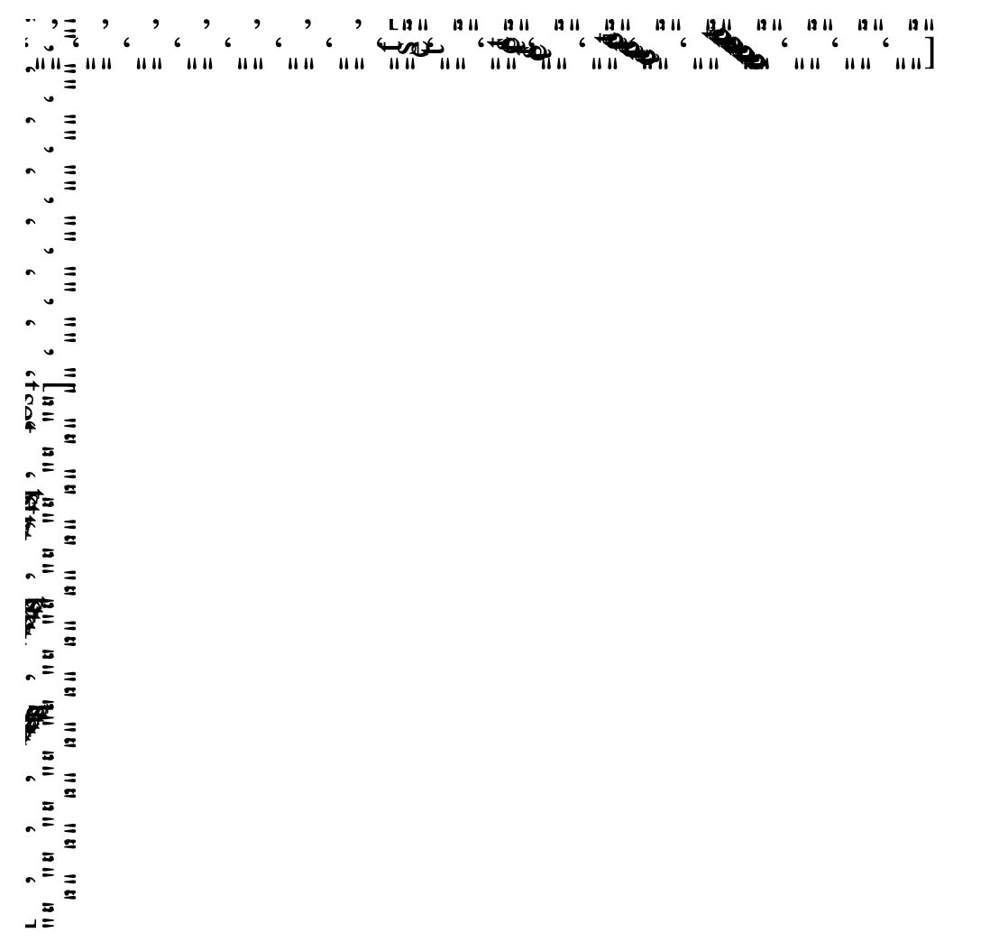
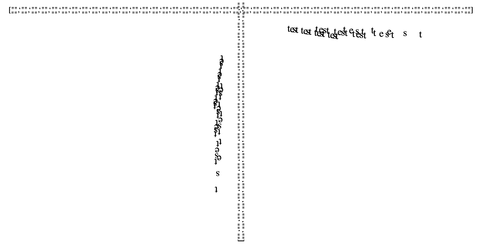
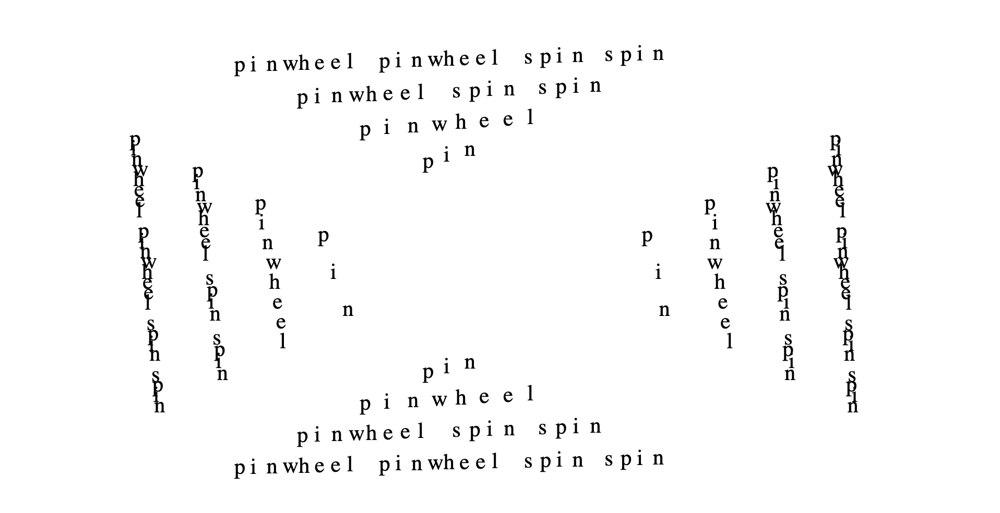

[assignment github](https://github.com/samheckle/mol/blob/master/pinwheel.ipynb)

## inspiration

i recently went to the MOMA and was inspired by the shape of Judith Lauand's *Concreto 61*

there is something about the simplicity and the shape that seemed conducive to text, and i wanted to utilize the same format to create my own poetry.

## process 

first was getting the rotation of the letters correct. since i was doing this dynamically with python rather than with illustrator or a graphical interface, it was challenging to get the rotations working. 

these experiments did have some beautiful outputs that i might want to explore in terms of using ascii art with my python generated concrete poetry.

## final

----
## resources
[code](https://github.com/samheckle/mol/blob/master/pinwheel.ipynb)