## Markovify
I decided to focus on the technical portion of my proposed robot and dynamically create asemic bible verses to be physically written later. I decided to end up breaking down my project for each class. When designing how the Bible verse data was collected, I initially thought to grab 10 or so verses by hand and putting them in a json file:

    [
        {
            "book": "Luke",
            "chapter": "50,",
            "verse": "3",
            "text1": "this is ",
            "text2": "sample verse"
        }
    ]

But then I realized that if I were to parse this json and randomly select each individual component I would basically be making a worse version of a Markov chain. So I checked if there is a python library to do so! 

https://github.com/jsvine/markovify

Following the readme, I tried installing:

    pip install markovify

HOWEVER this resulted in a terrible error:

    ERROR:root:code for hash md5 was not found.

# Technical Issues
I actually ran into some issues with setting my main termianl to use `zsh` instead of `bash`. My jupyter notebook was unable to set the kernal, which took a few hours of debugging. There were two issues here:

    1) my local python version had been reset to 2.7
    2) my jupyter notebook python virtual environment was having...problems

I required two solutions then. The first was simply upgrading my local python version by ensuring Python 3.9 was installed (it was), and changing the default for the zsh profile to use anaconda settings

    ln -s -f /usr/local/bin/python3.9 /usr/local/bin/python
    conda init zsh

This ensured that my anaconda settings were reflected in my zsh.

The second issue took more than an hour to figure out, but on perusing github forums, I found [this solution](https://github.com/microsoft/vscode-jupyter/issues/728#issuecomment-684923265) by upgrading my notebook. It took awhile, but ended up being fine.

## Parsing A Bible Corpus

After awhile of copying and pasting was an ineffient use of my time, and finally getting the Markov library to work, I needed to find a source for the actual verses I used. There has been a really big collaborative effort to put the bible online in every language available. But, it is all in xml.

https://github.com/christos-c/bible-corpus

But! They already account for that and even in the readme, they have instructions to do so.

    import xml.etree.ElementTree as ET
    lang = 'English'
    root = ET.fromstring(open(lang + '.xml').read())
    with open(lang + '.txt', 'w', encoding='utf-8') as out:
        for n in root.iter('seg'):
            out.write(n.text.strip() + '\n')

I pulled this into the [corpus.txt](https://github.com/samheckle/mol/blob/master/final/corpus.txt). From there I worked on the actual verse names. I kept with my original json architecture and created my [verses.json](https://github.com/samheckle/mol/blob/master/final/verses.json)

This all culminated in randomly generating verses that could be printed. The Markov chain generates the text, and I manually create the seperate verse name by random generation.

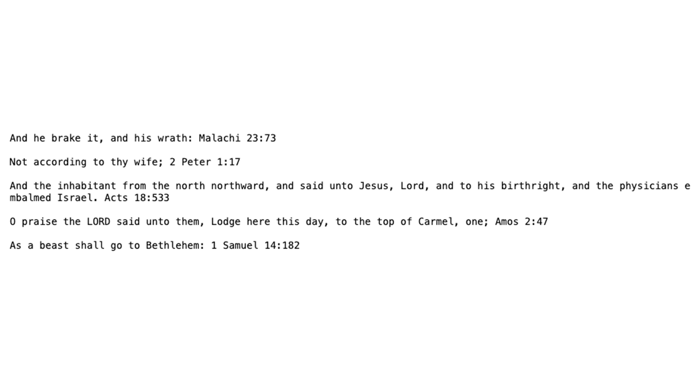

# First Attempt at Digital Display

My first attempt comprised of layering all of the verses together and the longest one would demonstrate the particular name. I liked this version because it really alluded to biblical text, because otherwise there would be no correlation.

# Second Attempts using Polyline

The following attempts were using Polyline to figure out how to get the specific coordinates with each individual glyph. 

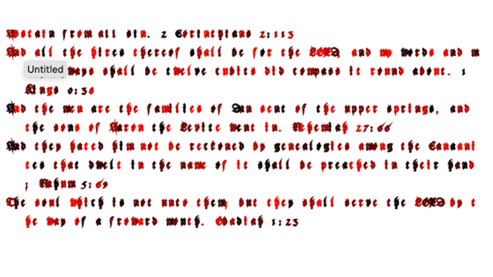

# Cursed Attempts

These were messing with the rotation and scale of the Polyline object. 

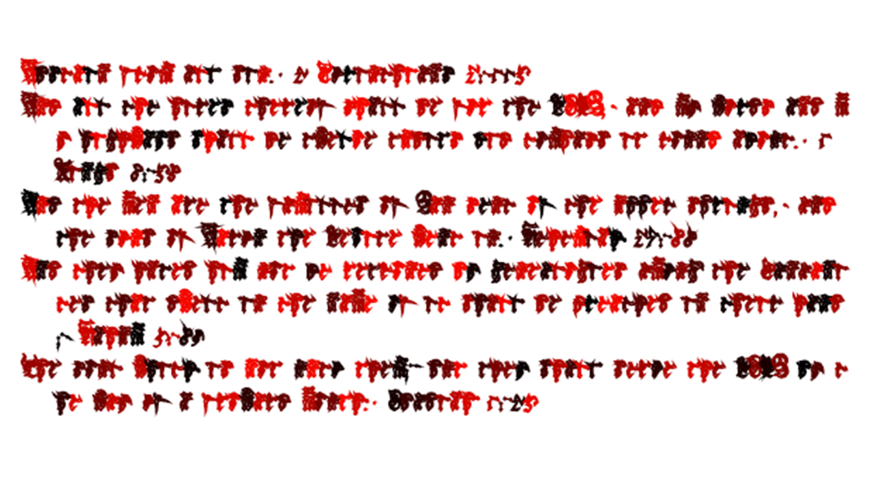

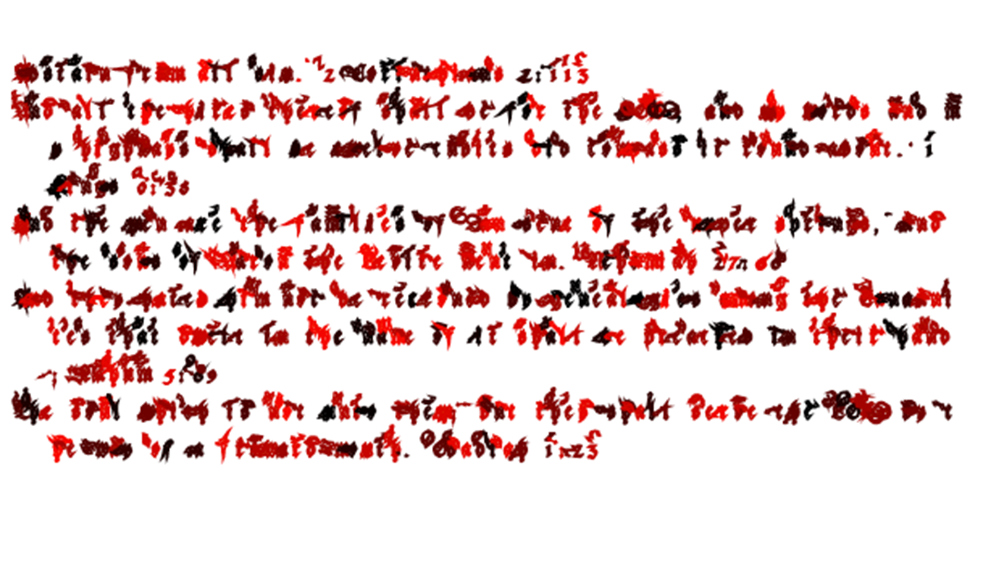

# final digital output

This is the final output 

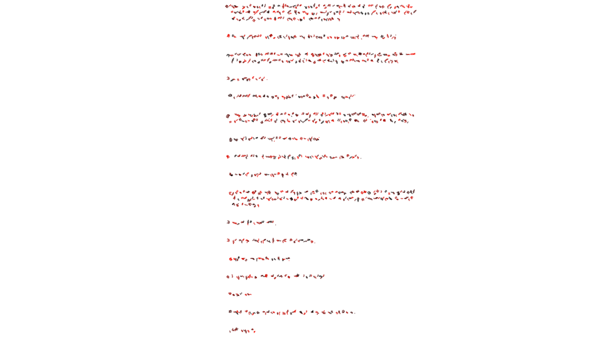

This will be the coordinates used to plot the text using the translations and making the entry above a physical output.

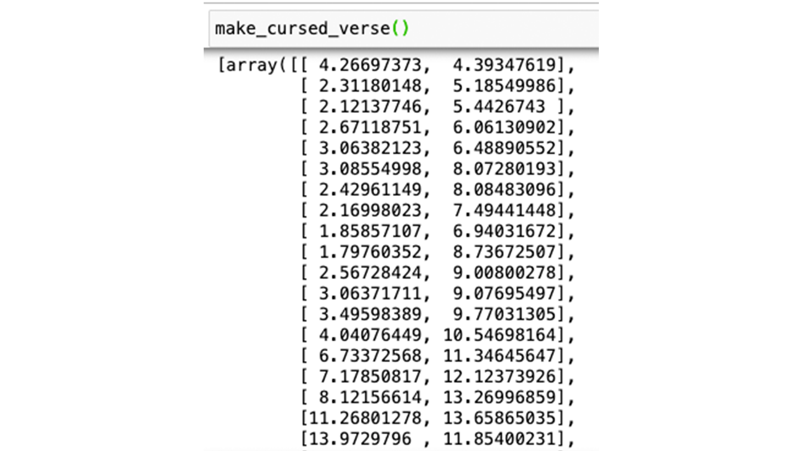

# using the axidraw

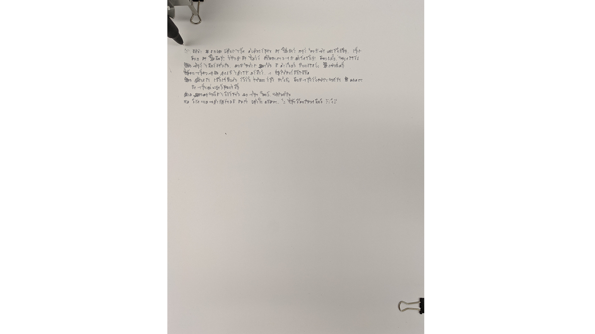

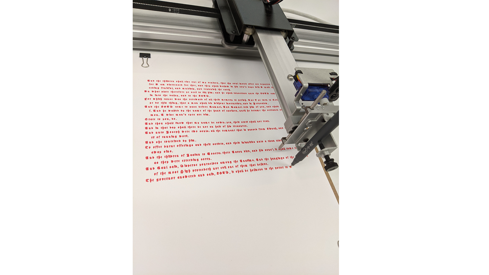

# Process

`youtube: https://youtu.be/uUY_obk7Nzg`

# Physical Output

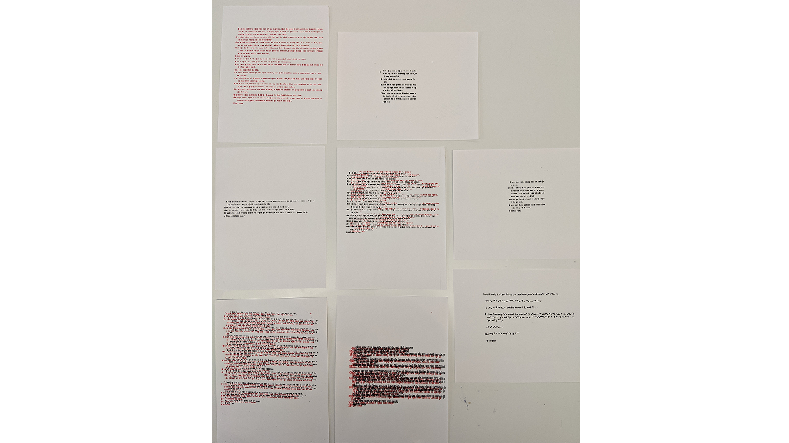

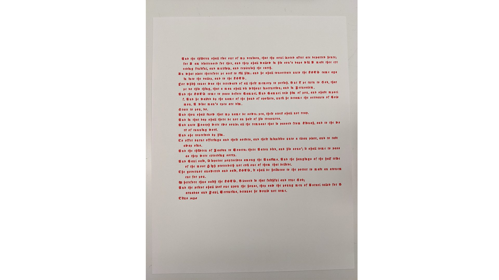

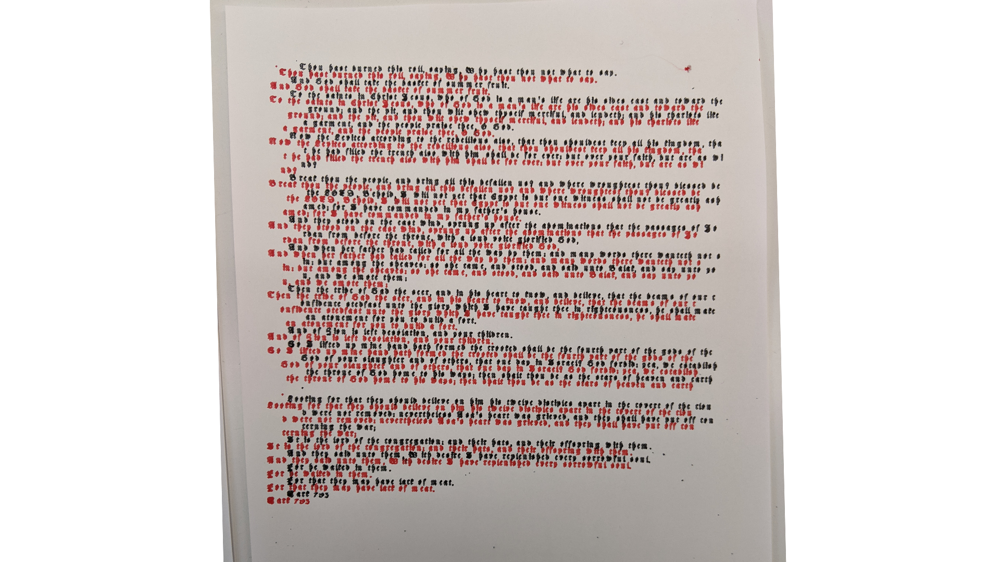

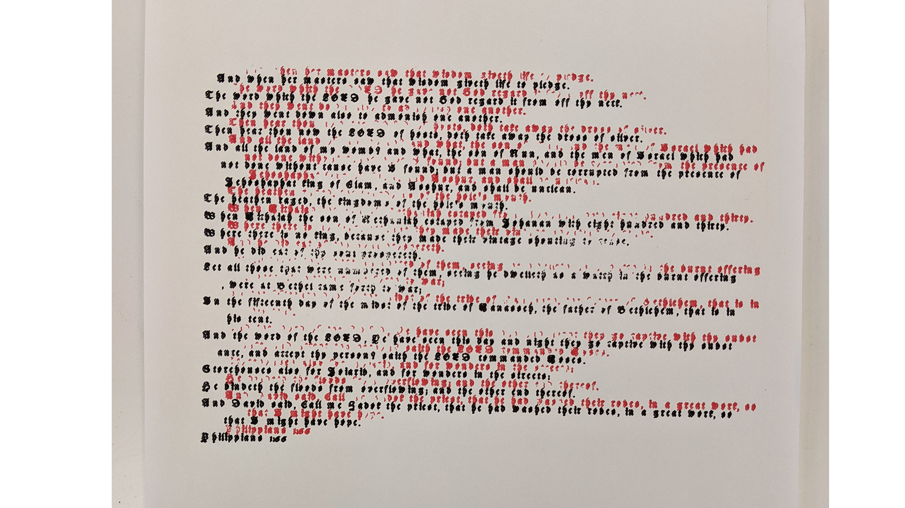

# Playtests

`youtube: https://youtu.be/g6rXuGAoDhk`

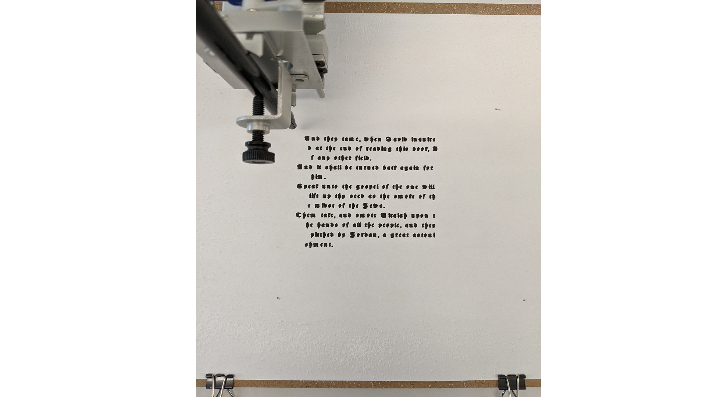

`youtube: https://youtu.be/4NGbqBkhlF4`

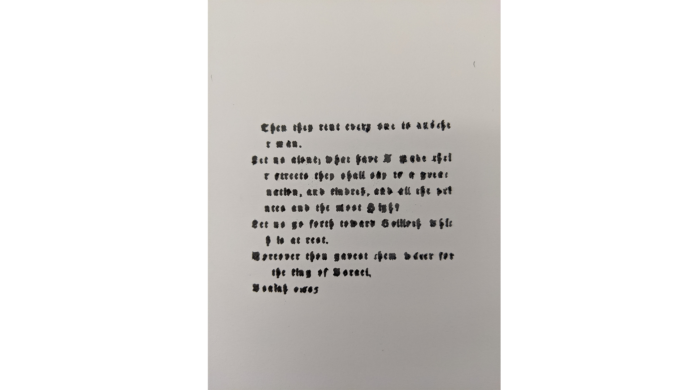

----
## resources
[code](https://github.com/samheckle/mol/blob/master/final/Final%20Project.ipynb)
[markovify](https://github.com/jsvine/markovify)