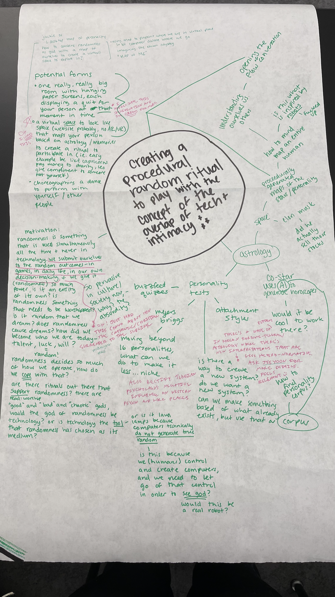
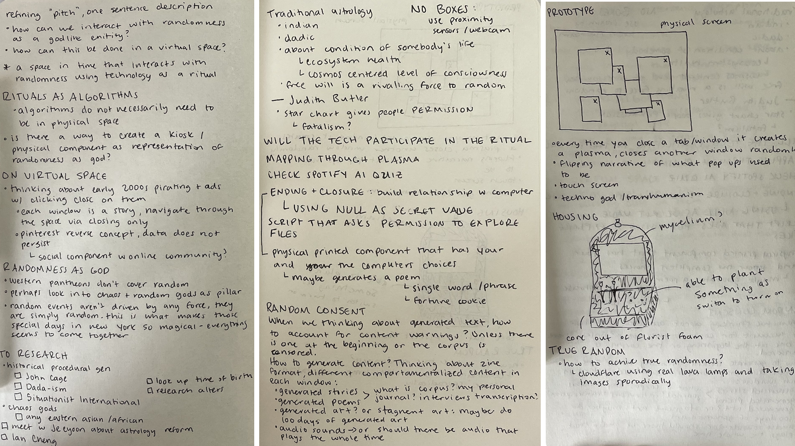
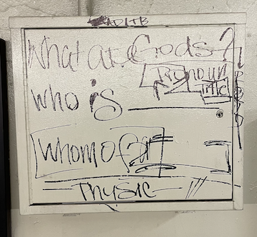
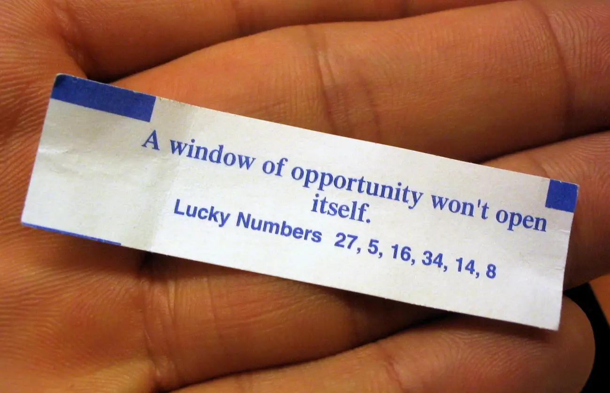
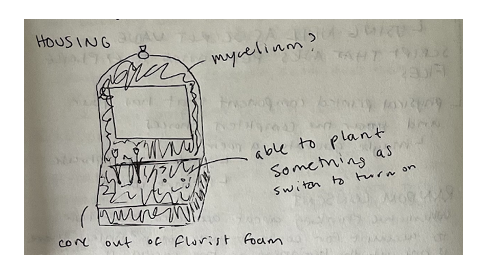

RITUALS AS ALGORITHMS

ALGORITHMS REJECT RANDOMNESS

RANDOMNESS IS GOD

## A Concept Map

## A Physical Artifact

Something I'm very into is having a physical artifact at the end of this project -- a notebook or a series of notebooks to reflect my thoughts.

## Some Thoughts, Distilled

# On Concept

After mind mapping I think I have landed on a concept::

how can technology interface as a medium between us in physical space to communicate with randomness as a god-like entity?

The theme lends itself to my interests -- randomness, rituals and spirituality, mythology, interfaces and fabrication.

# On Interface

I'm thinking about early 2000s popups:

What I'm imagining is a non-linear zine where each panel is a piece of curated generative art -- whether it be photos I have taken, tweets I have found, procedurally generated stories and poems, and other miscellaneous generated art.

Almost like a random gallery that the user is able to filter through. Navigating through the gallery is done by simply closing the popup. At the same time, however, the computer is also participating in the ritual. Each time you close a popup, the computer _also_ closes a popup.

At the end of the interaction, when all of the popups are closed, the interface prints out a fortune with a short word or phrase alluding to your experience, with random numbers on the back.

# On Fabrication

On the physical form of the object, I would like to make an alter. I do not know what shape it will take yet, but it must house a touchscreen and related electronics. 

One thing I do know is there are two ways to execute this alter:
1. To create it out of mycelium and house everything inside of a living vessel.
2. To create it out of cement and install it in the outdoors to see how the artifact interacts with the space around it. This would be more involved and would take a much longer period of time, but I would love to see this evolve into this type of installation. 

In terms of starting the ritual, it would be extremely nice to have it be triggered by using a seed. I'm imagining that you must plant something (an offering) to be able to communicate with "god" (randomness). I don't know how this would be executed in the concrete, but I believe with the mycelium / mushroom blocks it would be a matter of sensing the resistance of the plants. 

# Further Questions

At what point can this be considered a trans-human experience? Is it even trans / post-human at all? Or simply post modern religion?

How to achieve true randomness? Thinking about computer generated randomness is pseudo-random.

Is this inherently subscribed to fatalism? Need to do more research on this and specifically Judith Butler.

What would be the corpus for the generated stories? Submitted stories? My own personal journal entries? Transcription of interviews?

## Reading List

A non-definitive reading list that I will continue to append to

[click here 4 reading list](https://www.notion.so/samheckle/76f4c18d67694228ac5b702f9174cc6c?v=9276fa550dc4403ca73b3d1c4a95b93b)