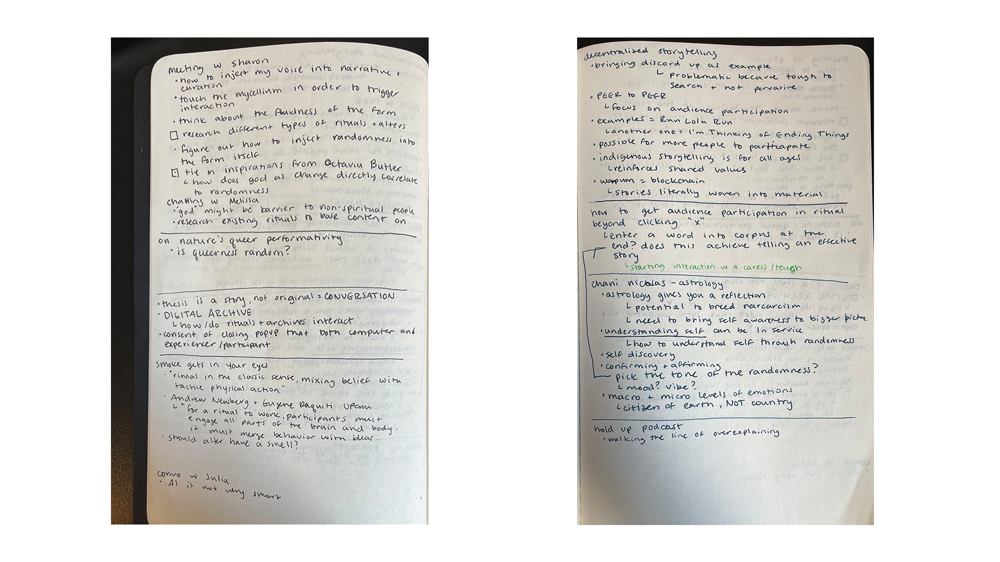

## Nature's Queer Performativity

One article I read this week on recommendation from [@chaski](https://www.instagram.com/chhaski/) was *Nature's Queer Performativity* by Karen Barad. [Here](https://samheckle.notion.site/Nature-s-Queer-Performativity-a99e1a8d0580449a95a826b2cc442821) are my exact reading notes, but I will sum them below.

Effectively this paper goes into detail about how non-human forms manifest in ways that defy the boundaries that we determine as both non-human and non-sentient. I found that the language used was challenging and may be unapproachable to non-academic readers. It was reminiscent of Haraway, a very scientific read on what it means to live in a multispecies world.

> Changes to the past don’t erase marks on bodies; the sedimenting material effects of these very reconfigurings – memories/rememberings – are written into the flesh of the world

Barad discusses lightning, stingrays, and atoms themselves and the amount of evidence where weirdness, and queerness, and boundary defying ways in which they exist. 

The key here, for me, was on identity. 

> There is no fixed dividing line between “self” and “other”, “past” and “present” and “future”, “here” and “now”, “cause” and “effect”.

I think that these will be a key focus in terms of content and story generation. I think that my stories will have themes pertaining not only to my interests, but the interests of the collective mind. If we think about randomness as a god, then are we thinking about how randomness impacts each and every living "critter"?

Thinking about how I can curate content that is applicable in that sense will be a challenge, but I think it will be an interesting task to embark on. I might take this paper and use it as a part of the corpus, or I might only take a few key quotes from it that might be applicable to the themes. This might be how I go about creating the corpus -- using my own academic research and curating the specific parts to feed into the machine.

## Some other articles that I perused but didn't comprehend

These were on recomendation from [@darnyill](https://www.instagram.com/darnyill/)

[Jenna Sutela](https://www.aqnb.com/2021/08/22/jenna-sutela-for-new-mystics-bacteria-wetware-psychedelic-silicon-valley-in-the-latest-from-the-artist-ai-collaborative-writing-project/)
[Lawerence Lek](https://www.aqnb.com/2021/09/22/lawrence-lek-for-new-mystics/)
[Mouth Of Darkness](https://mouthofdarkness.online/)