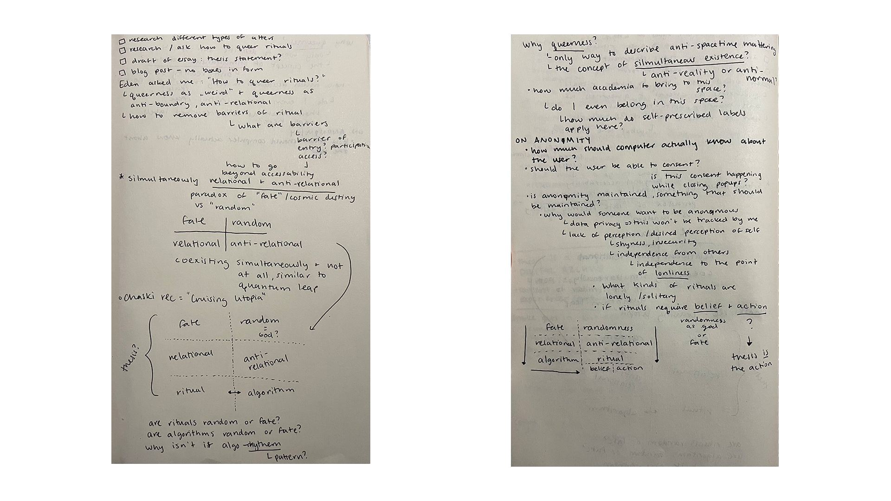

## Reading Notes from the Week

[Carrier Bag Theory of Fiction by Ursula K Le Guin](https://www.notion.so/samheckle/The-Carrier-Bag-Theory-of-Fiction-f75bb9d56498439cab464e18672f0fe5)

[Cruising Utopia by Jose Esteban Munoz](https://www.notion.so/samheckle/Cruising-Utopia-16ed7cfb50ba49fdb5d76d71e033c64b) which was another recommendation from the lovely [@chaski](https://www.instagram.com/chhaski/)

## General Thoughts from the Week

To put it more concisely, I would like to try to queer the concept of rituals. This was distilled for me by [@eden](https://itp.nyu.edu/thesisjournal2022/?author=8) where she asked some very insightful questions about the collectiveness of ritual, and how there is a paradox (and simultaneous parallel) of having a spiritual experience given through advertisements ie. it was fate that you *bought that thing* and there was meaning behind *buying that thing*. Effectively the person experiences confirmation bias on justifying how an algorithm just *knew* about them. This also ties in prescriptive vs. descriptive traits of a person that is simultaneously determined by themselves and by the algorithm that is constantly trying to throw content and seeing what sticks.

Using last week's reading of Barad's *Nature's Queer Performativity* and comparing it to Munoz's *Cruising Utopia*

> Understanding that the past has a performative nature, which is to say that rather than being static and fixed, the past does things

There is no boundary between fate and randomness, they coexist yet we only acknowledge one. Algorithms and rituals are the same, and can be treated as such. So when we interact with this piece, we interact with the unseen entity that is randomness. 

## Additional Resources

Other things I was looking at this week:

[default filename tv](https://default-filename-tv.neocities.org/)

A project that randomly pulls videos from youtube that use the default file name the camera titles each file.

[spaghetti](https://angeline-meitzler.com/#/spaghetti)

Another youtube based project that spawns new windows in the browser to endlessly create bowls of spaghetti until the computer is overwhelmed.

## Additional Form Brainstorming
# 🙅‍♀️ No Boxes 🙅‍♀️
- hole in the ground that mushrooms grow into (is this a box or a hole? dirt box??)
- oval shaped, flat like a serving tray that can be moved (how portable should it be?)

## First Essay "Draft"
[draft #1](https://docs.google.com/document/d/1Ufxng2w2xa5toYEJ608fLusW7NgCx9ek44hdR3EePwo/edit)

## Written Scenario of Experience
The observer of the ritual, who will now be referred to as observer, will kneel at the alter and touch any part of it to trigger the onboard screen to turn on. Once the screen turns on, it is immediately populated and bombards the observer with content and information. The observer now interacts with the screen, consuming the content and closing each popup as they peruse. Simultaneously, the computer participates and closes popups as well, so the observer is unable to consume all the content. After all the content has disappeared from the screen, the alter will print out a fortune cookie paper including a short description of the experience, along with random lucky numbers.