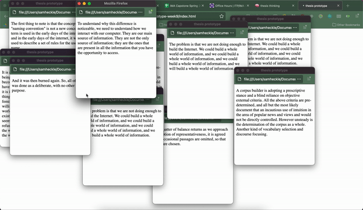

## theory updates

some readings this week! i transcribed some notes from _Pop Song: Adventures in Art and Intimacy_ in my notion [here](https://samheckle.notion.site/Pop-Song-Adventures-in-Art-and-Intimacy-3cb00b44087342b99e2a30ff082a143e) 

in these notes i also found further research to look into, specifically:
* Lesie Jamison - _A Grand Unified Theory of Female Pain_
* Kristeva's Theory of Abjection
* Johanna Fateman
* Roland Barthes - _A Lover's Discourse_

i've found that a lot of leisure readings i've been doing have been relevant to the work that i'm pursuing, perhaps because anything can be used as a corpus. i am trying to somewhat focus the corpus on the impact of technology in a speculative sense on humanness and society. but also there is something to be said about a world devoid of tech, and specifically capitalist technology. 

i also read this past week _Uncanny Valley_ by Anna Wiener, a memoir about the tech industry and subsequent disillusionment. this echoed my own feelings about using software to allegedly make life easier and more accessible, yet it seems we are only using these new techs for greed. not only greed of money, but time. why do we strive for efficiency? to have more time in the day? there are only 24 hours and yet it seems that the value of that 24 hours depends on the wealth of a person. 

## system updates

i'm thinking more about how to execute the project -- i am thinking about building a custom os similar to [JackieOS](http://www.jackies.world/). this is web based, but if i wanted it to be on a raspberry pi, it would need to be able to run on minimal browser windows. or, i can create a custom linux distro and put that on a pi instead. this will definitely require further experimentation, but as of my last prototype i don't think that would be able to be achievable on a pi.

## putting this prototype out there

